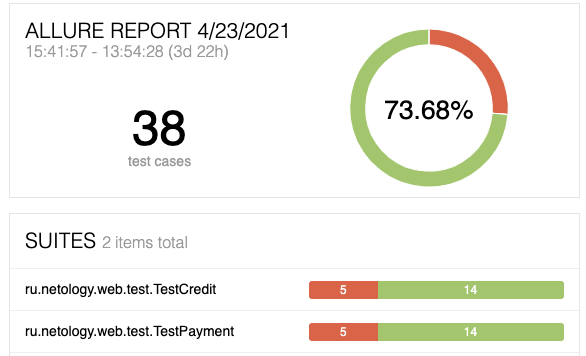

## Отчет о проведенном тестировании

### Краткое описание:
Дипломный проект представляет собой автоматизацию тестирования комплексного сервиса, взаимодействующего с СУБД и API Банка.

Приложение предлагает купить тур по определённой цене с помощью двух способов:
* Обычная оплата по дебетовой карте
* Уникальная технология: выдача кредита по данным банковской карты

Само приложение не обрабатывает данные по картам, а пересылает их банковским сервисам:
* сервису платежей (далее - Payment Gate)
* кредитному сервису (далее - Credit Gate)

Приложение должно в собственной СУБД сохранять информацию о том, каким способом был совершён платёж и успешно ли он был совершён (при этом данные карт сохранять не допускается).
Заявлена поддержка двух СУБД:
* MySQL
* PostgreSQL

### Количество тест-кейсов
Всего реализовано 38 тест кейсов, из которых:
* 4 позитивных тест кейса (API тесты)
* 34 теста по проверке ввода данных в поля (UI тесты)

**успешных 73,7% /
не успешных 26,3%**

По результатам тестирования заведено 6 баг-репортов [Issues](https://github.com/TanyTany/Diploma/issues)

### Общие рекомендации:

1. Исправить баг с покупкой по неуспешной карте.
2. Убрать сообщения о неверном формате после исправления значений, вводимого в поле рядом с полями “Номер карты” и “CVC код”
3. Проработать в поле "Владелец" проверку ввода невалидных данных
4. Исправить видимость предупреждающего сообщения под полем “Владелец”, когда оно заполнено, но не заполнено поле CVC.

